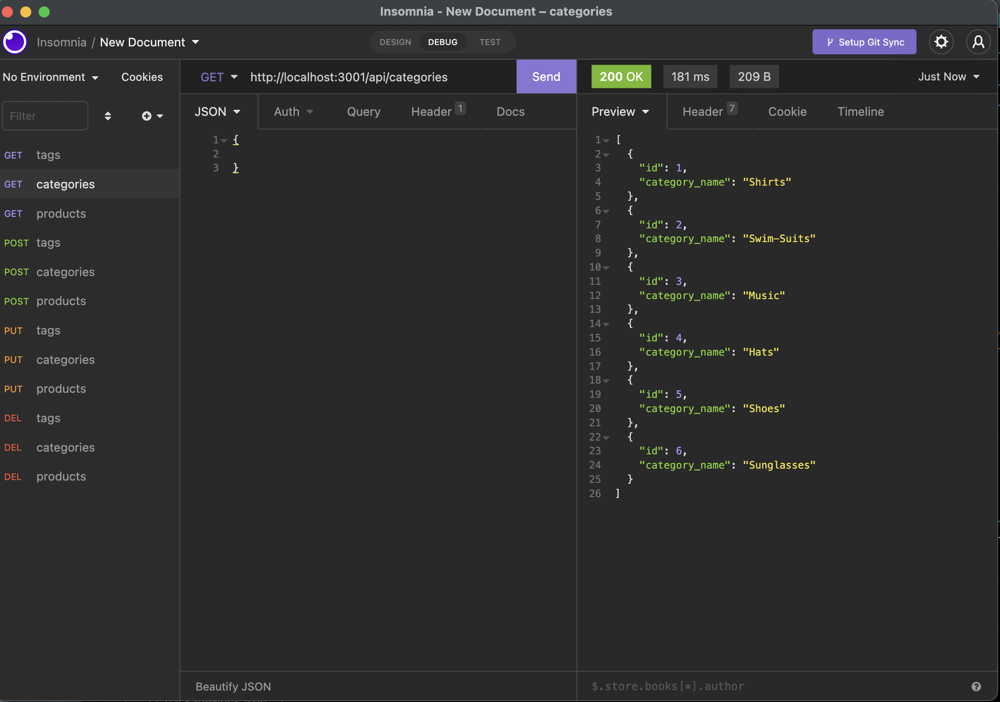
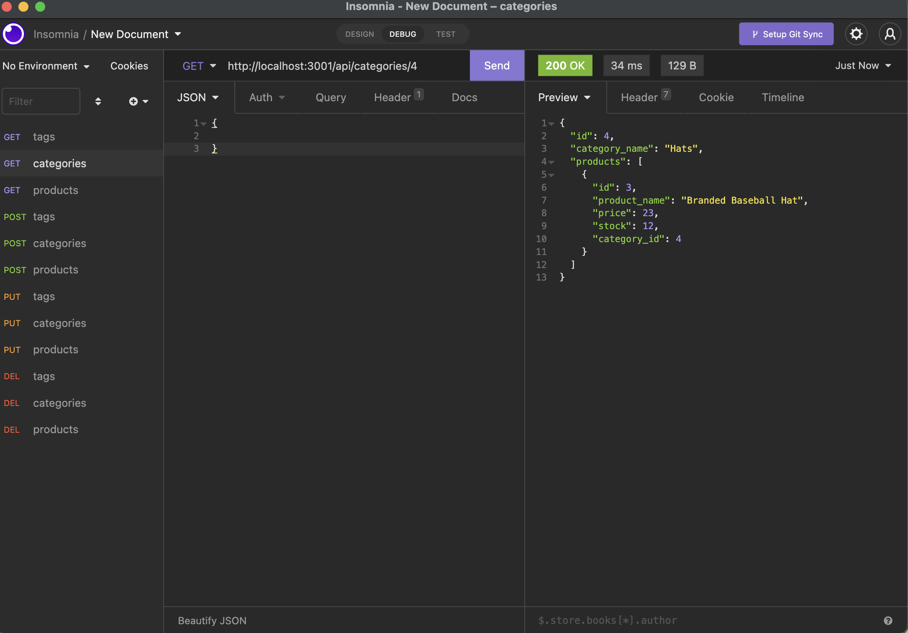
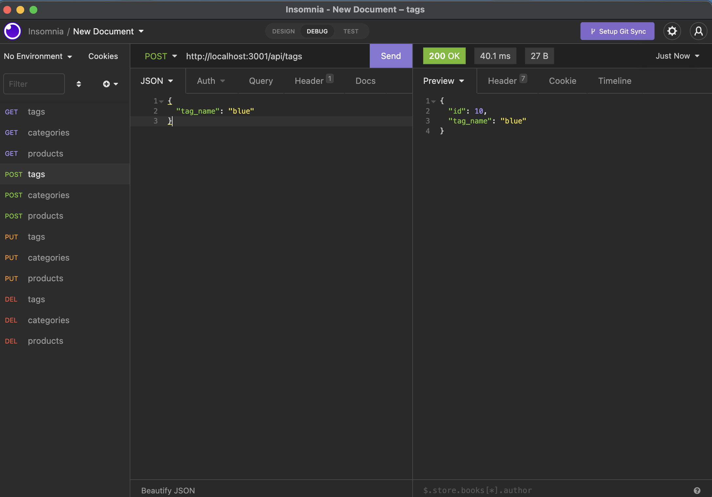
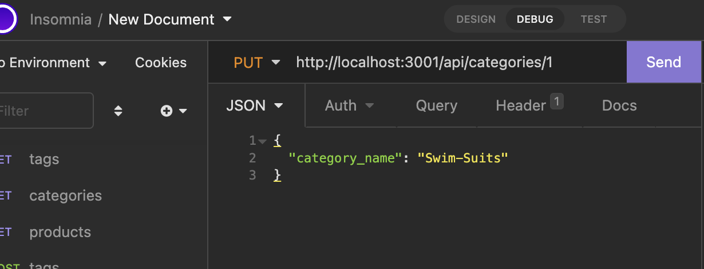
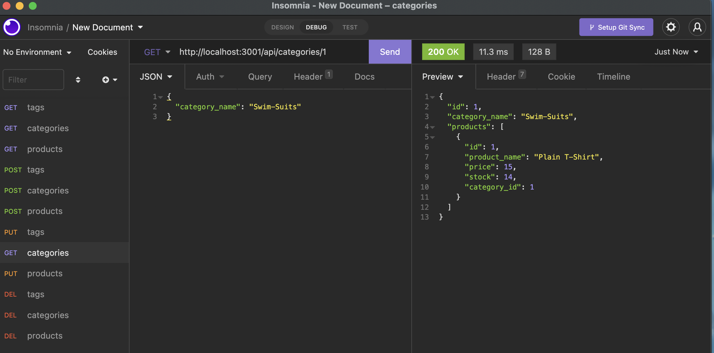
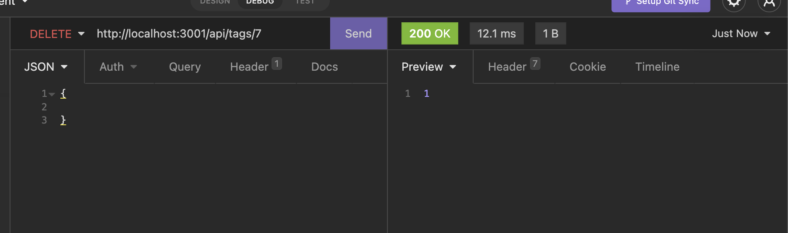
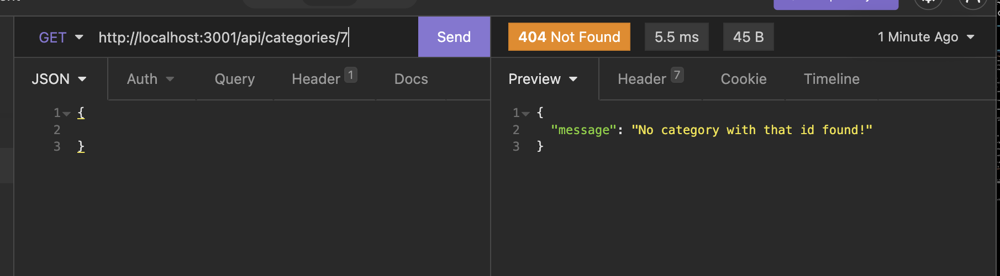

# Orm E-Commerce Database

    ##Table of Contents
   
[Description](#description)
    
[Installation](#installation)
    
[Usage](#usage)
    
[License](#license)
    
[Features](#features)
    
[Testing](#testing)
    
[Questions](#questions)
    
## Description
    
A back-end application using Mysql database with Nodejs and the sequiliz and express npm's.
    
## Installation
    
The npm install command will install all the dependencies.
    
## Usage
    
Once you have installed all the packages, run the npm run seed command to fill out the data base with data. Run npm start to start up the database.
    
## License
    
MIT
    
## Features
GET(findAll), GET by id(findByPk), POST(create), PUT(update), DELETE(destroy)

GET ALL category

GET by id category

POST new tag

PUT new category

GET updated category

DELETE

GET after delete to return not found

## Questions

(https://github.com/Ckratz17/Orm-E-Commerce)

ckratz17@gmail.com